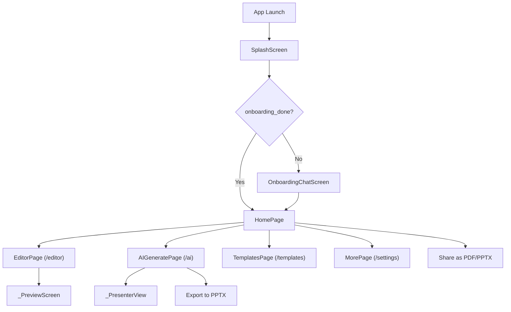

# AI Presentation — Professional Audit Document

> **Project**: `aipresentation` (Flutter, iOS-focused)
> **SDK**: Dart ^3.8.1 · Flutter 3.x
> **Audit Date**: 2026-02-10
> **Auditor Scope**: Full codebase review — architecture, UX, security, performance, iOS readiness

---

## 1. Core Feature Breakdown

| # | Feature | Files | Business-Critical? |
|---|---------|-------|-------------------|
| 1 | **Splash Screen** | [splash.dart](file:///Users/macbookair/Desktop/aipresentation/lib/opening/splash.dart) | ✅ Yes — first impression, brand loading |
| 2 | **Onboarding Chat Flow** | [onboards.dart](file:///Users/macbookair/Desktop/aipresentation/lib/opening/onboards.dart) | ✅ Yes — user profiling, first-run experience |
| 3 | **Home Dashboard** | [homepage.dart](file:///Users/macbookair/Desktop/aipresentation/lib/ui/homepage.dart) | ✅ Yes — primary hub, templates, recents |
| 4 | **Presentation Editor** | [editor.dart](file:///Users/macbookair/Desktop/aipresentation/lib/ui/editor.dart) | ✅ Yes — core slide editing, image attachment |
| 5 | **AI-Powered Editor** | [ai_generate.dart](file:///Users/macbookair/Desktop/aipresentation/lib/ui/ai_generate.dart) | ✅ Yes — AI outline + image generation via OpenAI |
| 6 | **Slide Preview / Presenter** | Embedded in `editor.dart` and `ai_generate.dart` | ✅ Yes — presentation playback |
| 7 | **PDF Export & Share** | [homepage.dart](file:///Users/macbookair/Desktop/aipresentation/lib/ui/homepage.dart) (`_buildPdfFile`) | ✅ Yes — export deliverable |
| 8 | **PPTX Export & Share** | [homepage.dart](file:///Users/macbookair/Desktop/aipresentation/lib/ui/homepage.dart) (`_buildPptxBytes`), [ai_generate.dart](file:///Users/macbookair/Desktop/aipresentation/lib/ui/ai_generate.dart) (`_exportToPptx`) | ✅ Yes — export deliverable |
| 9 | **Template Gallery** | [template.dart](file:///Users/macbookair/Desktop/aipresentation/lib/ui/template.dart), inline in `homepage.dart` | ⚠️ Semi-critical — templates are hardcoded, not dynamic |
| 10 | **Search (Templates + Recents)** | [homepage.dart](file:///Users/macbookair/Desktop/aipresentation/lib/ui/homepage.dart) (`_HomeSearchDelegate`) | ⚠️ Optional — convenience feature |
| 11 | **Sign In with Apple** | [setting.dart](file:///Users/macbookair/Desktop/aipresentation/lib/ui/setting.dart) | ✅ Yes — gate for sharing, identity |
| 12 | **In-App Purchase / Premium** | [setting.dart](file:///Users/macbookair/Desktop/aipresentation/lib/ui/setting.dart), [constant.dart](file:///Users/macbookair/Desktop/aipresentation/lib/src/constant.dart), RevenueCat files | ✅ Yes — monetization |
| 13 | **Local Persistence** | [storage.dart](file:///Users/macbookair/Desktop/aipresentation/lib/utility/storage.dart) | ✅ Yes — presentation save/load |
| 14 | **Settings / Profile** | [setting.dart](file:///Users/macbookair/Desktop/aipresentation/lib/ui/setting.dart) | ✅ Yes — account, legal, premium |

### Dead / Boilerplate Code (not wired to main flow)

| File | Issue |
|------|-------|
| [cats.dart](file:///Users/macbookair/Desktop/aipresentation/lib/src/cats.dart) | RevenueCat sample "CatsScreen" — refund and in-app messages demo. **Not used in production flow.** |
| [upsell.dart](file:///Users/macbookair/Desktop/aipresentation/lib/src/upsell.dart) | RevenueCat sample upsell screen — raw purchase buttons. **Not reached from any route.** |
| [initial.dart](file:///Users/macbookair/Desktop/aipresentation/lib/src/initial.dart) | RevenueCat sample entry screen. **Not used.** |
| [paywall.dart](file:///Users/macbookair/Desktop/aipresentation/lib/src/paywall.dart) | Wrapper around `PaywallView`. Only called indirectly from `constant.dart`. |
| [paywall_footer_screen.dart](file:///Users/macbookair/Desktop/aipresentation/lib/src/paywall_footer_screen.dart) | Another RevenueCat sample. **Not used.** |

> [!WARNING]
> At least **5 files** in `lib/src/` are boilerplate from the RevenueCat SDK sample and are not integrated into the app's navigation. They add dead weight, confuse new developers, and increase attack surface.

---

## 2. UI & UX Analysis

### 2.1 Navigation Flow



### 2.2 UX Friction Points

| # | Friction | Severity | Location |
|---|---------|----------|----------|
| 1 | **Two separate editor screens** (`EditorPage` and `AIGeneratePage`) with ~70% duplicate code. User lands in different editors depending on entry point, creating inconsistent experience. | 🔴 High | `editor.dart`, `ai_generate.dart` |
| 2 | **Bottom nav doesn't persist** — tapping "AI", "Templates", or "Profile" navigates via `pushNamed` instead of switching tabs. The `_currentIndex` resets on return. | 🔴 High | `homepage.dart:860-883` |
| 3 | **"Go Premium" pill** and **Settings icon** both navigate to `/settings` — redundant touch targets in the AppBar. | 🟡 Medium | `homepage.dart:343-352` |
| 4 | **Onboarding answers are discarded** — the 5-step chat questionnaire collects user preferences but never uses them (no persistence, no influence on templates or AI behavior). | 🔴 High | `onboards.dart` |
| 5 | **Search bar is read-only** and opens a `SearchDelegate` which is non-standard UX for iOS users. | 🟡 Medium | `homepage.dart:458-474` |
| 6 | **No undo/redo** in editors — destructive actions (delete slide, paste outline overwrite) have no recovery. | 🟡 Medium | Both editor files |
| 7 | **No delete confirmation** for slides — single tap deletes immediately. Only presentations get a delete option via popup. | 🟡 Medium | `editor.dart:189-198` |
| 8 | **Share requires login** but login is buried in Settings. The error dialog to redirect is jarring. | 🟡 Medium | `homepage.dart:71-97` |
| 9 | **Images stored only in memory** (`Map<String, Uint8List>`) — images are lost when the user closes and reopens the editor. They are not persisted with the presentation. | 🔴 High | `editor.dart:39`, `ai_generate.dart:103` |
| 10 | **Auto-save snackbar fires on every autosave** — intrusive "Saved" toast appears every 600ms during rapid typing. | 🟡 Medium | `ai_generate.dart:218-227` |

### 2.3 Outdated / Generic UI Patterns

| Pattern | Issue |
|---------|-------|
| `BottomNavigationBar` | Material Design component, not `CupertinoTabBar`. Feels Android-first on iOS. |
| `AlertDialog` everywhere | All modals use Material `AlertDialog` instead of `CupertinoAlertDialog`. Inconsistent with iOS conventions. |
| `TextField` with `OutlineInputBorder` | Looks Material-native. iOS users expect `CupertinoTextField` or at minimum rounded, borderless inputs. |
| `SnackBar` for feedback | iOS apps typically use toasts, banners, or in-context feedback — not Material snackbars. |
| `WillPopScope` | Deprecated in Flutter 3.22+. Should use `PopScope`. |
| `PopupMenuButton` | Material component. iOS users expect swipe actions or `CupertinoContextMenu`. |

### 2.4 iOS HIG Violations

| # | Violation | Details |
|---|----------|---------|
| 1 | **No `CupertinoNavigationBar`** on main screens | `HomePage`, `EditorPage`, `AIGeneratePage`, `TemplatesPage` all use Material `AppBar`. Only `SplashScreen` and `OnboardingChatScreen` use Cupertino widgets. |
| 2 | **No swipe-to-delete** | Recents list uses `PopupMenuButton` for delete, not iOS-standard swipe gesture. |
| 3 | **No haptic feedback** | No usage of `HapticFeedback` on destructive or confirmatory actions. |
| 4 | **Mixed widget systems** | Splash and onboarding use Cupertino, but the rest of the app uses Material. This creates visual inconsistency. |
| 5 | **No system dark mode support** | App forces a single light theme. No `CupertinoThemeData` or `MediaQuery.platformBrightnessOf`. |
| 6 | **No dynamic type scaling** | Font sizes are hardcoded. Does not respect `MediaQuery.textScaleFactorOf`. |

---

## 3. Architecture Review

### 3.1 State Management

| Aspect | Current Approach | Assessment |
|--------|-----------------|------------|
| **Pattern** | Raw `setState()` everywhere | 🔴 No centralization. All state is colocated in StatefulWidgets. |
| **Premium status** | Fetched in multiple places (`ai_generate.dart`, `setting.dart`), cached in `SharedPreferences` | 🟡 Fragile — duplicate logic, potential desync. |
| **Auth state** | Stored as `SharedPreferences` booleans (`is_logged_in`, `user_email`) | 🔴 Not reactive — other screens don't know when user logs in/out. |
| **Presentation data** | Loaded per-screen from `SharedPreferences` | 🟡 Works but doesn't scale. No reactive updates across screens. |

> [!IMPORTANT]
> The project has **no state management solution** (no Provider, Riverpod, Bloc, etc.). For a redesign, this is the single most impactful architectural change needed.

### 3.2 Folder Structure

```
lib/
├── main.dart                    # App entry + LaunchGate
├── opening/
│   ├── onboards.dart            # Onboarding (Cupertino)
│   └── splash.dart              # Splash (Cupertino)
├── src/
│   ├── cats.dart                # ❌ Dead code (RevenueCat sample)
│   ├── constant.dart            # API keys + premium check
│   ├── initial.dart             # ❌ Dead code (RevenueCat sample)
│   ├── paywall.dart             # Paywall wrapper
│   ├── paywall_footer_screen.dart  # ❌ Dead code (RevenueCat sample)
│   ├── store_config.dart        # Store config singleton
│   └── upsell.dart              # ❌ Dead code (RevenueCat sample)
├── ui/
│   ├── ai_generate.dart         # 1564 lines — AI editor + presenter + loader + painter
│   ├── editor.dart              # 1014 lines — Manual editor + preview + deck slide
│   ├── homepage.dart            # 1141 lines — Home + search + PDF/PPTX builder
│   ├── setting.dart             # 422 lines — Settings/Profile
│   └── template.dart            # 132 lines — Template gallery
└── utility/
    ├── apikey.dart              # ⚠️ Hardcoded OpenAI key
    ├── models.dart              # Slide, Presentation, RecentPresentation
    └── storage.dart             # SharedPreferences CRUD
```

**Assessment:**
- 🔴 **God files**: `ai_generate.dart` (1564 lines), `homepage.dart` (1141 lines), and `editor.dart` (1014 lines) each contain multiple widgets, business logic, network calls, and export functions in single files.
- 🔴 **No service layer**: AI API calls, PDF/PPTX generation, and storage are embedded directly in widget state classes.
- 🔴 **No model/view separation**: `Presentation` model is simple data class with no business logic, but all operations are in widgets.
- 🟡 **Naming**: `src/` is misleading — contains IAP/paywall code + dead RevenueCat samples. `utility/` mixes config with data access.

### 3.3 Separation of Concerns

| Concern | Current Location | Should Be |
|---------|-----------------|-----------|
| AI API calls | `_AIGeneratePageState` methods | Dedicated `AIService` class |
| PDF generation | `_HomePageState._buildPdfFile()` | `ExportService` |
| PPTX generation | `_HomePageState._buildPptxBytes()`, `_AIGeneratePageState._exportToPptx()` | `ExportService` (shared) |
| Premium check | Inline in `_AIGeneratePageState`, `_MorePageState` | `AuthService` or `PremiumRepository` |
| Storage | `Storage` static class — acceptable | Keep, but add abstractions |
| Image storage | In-memory `Map<String, Uint8List>` in widget state | Persistent image cache service |

### 3.4 Scalability Issues

1. **SharedPreferences for presentation data** — All presentations are JSON-serialized into SharedPreferences. This hits size limits with many presentations or large content. Should migrate to SQLite (sqflite/drift) or filesystem.
2. **No pagination** — Recents list loads all 30 items at once. Templates is a hardcoded 6-item list.
3. **No dependency injection** — Services are hardcoded or static. Testing is impossible without refactoring.
4. **TextEditingController recreation** — `editor.dart` creates new `TextEditingController` instances on every build (`_slideCanvas`), causing cursor position loss and widget rebuilds.

---

## 4. Performance & iOS Readiness

### 4.1 Animation Performance Risks

| Risk | Location | Impact |
|------|----------|--------|
| `BackdropFilter` with high sigma | `_GlassLoader` in both editors (sigma 8×8) | 🟡 GPU-intensive on older iPhones. Acceptable on iPhone 12+. |
| `CustomPainter` spinning ring | `_RingPainter` in `ai_generate.dart` | 🟢 Low impact — small area, simple geometry. |
| `AnimatedContainer` for dot indicators | Preview screens | 🟢 Low impact. |
| `Image.memory()` for large AI images | Slide canvas and presenter | 🟡 No caching or resizing. Large 1024×1024 images decoded on every rebuild. |
| `precacheImage` in `didChangeDependencies` | `homepage.dart:64-69` | 🟢 Good practice for asset templates. |

### 4.2 iOS-Specific Problems

| # | Problem | Details |
|---|---------|---------|
| 1 | **`WillPopScope` deprecated** | Should use `PopScope` (Flutter 3.22+). Will generate deprecation warnings. |
| 2 | **Android platform code still present** | `android/` directory and Amazon/Google store configs are included despite being iOS-focused. |
| 3 | **No `NSPhotoLibraryUsageDescription` verification** | `image_picker` requires Info.plist keys. Not checked in this audit. |
| 4 | **Google Fonts network dependency** | `google_fonts` fetches fonts at runtime on first use. On slow/no network, text may render with system fallback or delay. Should bundle fonts. |
| 5 | **No `WidgetsBindingObserver`** for app lifecycle | App doesn't listen for `AppLifecycleState.paused` to auto-save. Data could be lost. |

### 4.3 Build & Runtime Risks

| Risk | Severity |
|------|----------|
| `dart_pptx: ^0.1.3` — very early-stage package (0.x). Limited features, possible breaking changes. | 🟡 |
| `kNetworkLog = true` hardcoded — debug prints active in release builds. | 🟡 |
| `print()` statements throughout paywall and IAP code — should use `debugPrint` or be removed. | 🟡 |
| No `flutter_test` tests exist — zero test coverage. | 🔴 |

---

## 5. Security Review

### 5.1 Authentication Approach

| Aspect | Assessment |
|--------|-----------|
| **Method** | Sign In with Apple only | ✅ Good for iOS |
| **Session persistence** | `SharedPreferences.setBool('is_logged_in', true)` | 🔴 **Critical** — trivially spoofable. No token, no server validation. |
| **Logout** | Removes `is_logged_in` and `user_email` from prefs | 🟡 Acceptable for local-only |
| **No backend auth** | Auth is entirely client-side | 🔴 Anyone can set `is_logged_in = true` in prefs and bypass share gate |

### 5.2 API Key Exposure

> [!CAUTION]
> **`lib/utility/apikey.dart` contains a hardcoded OpenAI API key in plain text:**
> ```dart
> static const openAIKey = 'sk-proj-sjavS2nY...';
> ```
> This key is:
> - Compiled into the binary and extractable via reverse engineering
> - Appears in source control (if pushed to GitHub)
> - Grants full access to the OpenAI account's API with no rate limiting on the client side
>
> **Risk**: Unauthorized API usage, financial exposure, and potential account suspension.

### 5.3 RevenueCat API Key

```dart
const appleApiKey = 'appl_GiIpkYqcClVzAbuOJuFpWIoUJpG';
```

RevenueCat public API keys are designed to be client-side and are less sensitive, but the `googleApiKey` and `amazonApiKey` placeholders suggest incomplete configuration.

### 5.4 Local Storage Risks

| Data | Storage | Risk |
|------|---------|------|
| Auth state (`is_logged_in`) | SharedPreferences (unencrypted plist) | 🔴 Trivially readable/writable |
| User email | SharedPreferences | 🟡 PII in unencrypted storage |
| Premium status cache | SharedPreferences (`is_premium`) | 🔴 Can be spoofed to bypass paywall locally |
| All presentations | SharedPreferences (JSON strings) | 🟡 Size limits, no encryption |
| Images | In-memory only (not persisted) | 🟡 Works accidentally as a "feature" — no permanent image data stored |

### 5.5 API Handling Risks

| Risk | Details |
|------|---------|
| **No request authentication from backend** | API calls go directly from client to OpenAI. No proxy server. |
| **No rate limiting** | User can spam AI generation with no cooldown. Each generates images with retry (up to 3× per image). |
| **Error messages exposed** | Raw OpenAI error bodies are surfaced to the user via snackbars (including error codes and types). |
| **Network logging in production** | `kNetworkLog = true` with `debugPrint` of request/response bodies — may log sensitive data. |

### 5.6 Missing Security Best Practices

- ❌ No certificate pinning
- ❌ No encrypted local storage (should use `flutter_secure_storage`)
- ❌ No jailbreak/root detection
- ❌ No API key rotation mechanism
- ❌ No input sanitization on AI prompts (injection risk via prompt manipulation)

---

## 6. Improvement Opportunities

### 6.1 UI Improvements (without changing core features)

| # | Improvement | Rationale |
|---|------------|-----------|
| 1 | **Unify to Cupertino widgets** across all screens | Consistent iOS-native feel. Currently split between Cupertino (splash/onboarding) and Material (everything else). |
| 2 | **Replace `BottomNavigationBar` with `CupertinoTabScaffold`** | Proper iOS tab bar with persistent state per tab. |
| 3 | **Dark mode support** | Follow system setting via `CupertinoDynamicColor` or Material `ThemeData.dark()`. |
| 4 | **Merge two editors into one** | `EditorPage` and `AIGeneratePage` are ~70% identical. Merge into a single `EditorScreen` with AI features toggled via a toolbar button. |
| 5 | **Swipe-to-delete on recents** | Replace `PopupMenuButton` with `Dismissible` or `CupertinoContextMenu`. |
| 6 | **Bundle fonts** instead of runtime download | Eliminate Google Fonts network dependency. |
| 7 | **Clean up dead RevenueCat sample files** | Remove `cats.dart`, `upsell.dart`, `initial.dart`, `paywall_footer_screen.dart`. |

### 6.2 UX Improvements

| # | Improvement | Rationale |
|---|------------|-----------|
| 1 | **Persist onboarding answers** | Use them to pre-select AI style/template on first generation. |
| 2 | **Persist slide images to disk** | Images currently live only in memory and are lost on app restart. |
| 3 | **Auto-save without snackbar** | Use a subtle "saved" indicator (checkmark in AppBar) instead of intrusive snackbar. |
| 4 | **Add undo/redo** | Critical for a content creation tool. |
| 5 | **Slide reordering** | Allow drag-and-drop reordering in the sidebar. |
| 6 | **Fix TextEditingController recreation** | `editor.dart` creates new controllers on every build, losing cursor position. `ai_generate.dart` already caches them — apply the same pattern. |
| 7 | **Show premium badge contextually** | If user is already premium, don't show "Go Premium" pill in AppBar. |

### 6.3 Security Enhancements

| # | Enhancement | Priority |
|---|-----------|----------|
| 1 | **Move OpenAI API key to a backend proxy** | 🔴 Critical — eliminates client-side key exposure |
| 2 | **Use `flutter_secure_storage` for sensitive data** | 🔴 Critical — auth tokens, premium status |
| 3 | **Implement server-side auth validation** | 🔴 Critical — current "is_logged_in" flag is meaningless |
| 4 | **Add rate limiting on AI generation** | 🟡 Medium — prevent abuse and cost overruns |
| 5 | **Strip `print()` statements** | 🟡 Medium — information leakage in release builds |
| 6 | **Set `kNetworkLog = false` for release** | 🟡 Medium — use `kDebugMode` flag instead |
| 7 | **Add certificate pinning** for API calls | 🟡 Medium — prevent MITM attacks |

### 6.4 Animation & Interaction Ideas

| # | Idea | Details |
|---|------|---------|
| 1 | **Hero transitions** between template grid and editor | Template thumbnail morphs into the editor canvas. |
| 2 | **Spring physics for slide sidebar** | Add `flutter_animate` spring effects to slide selection. Package is already a dependency. |
| 3 | **Haptic feedback** on save, delete, and slide transitions | Use `HapticFeedback.lightImpact()` for iOS-native feel. |
| 4 | **Skeleton loading** for AI generation | Replace glass loader with content-aware skeleton placeholders (slide shapes that fill in). |
| 5 | **Parallax on template cards** | Subtle tilt effect on template thumbnails using `Transform` based on gesture position. |
| 6 | **Page curl transition** for presenter mode | More presentation-like feel using `flutter_animate` or custom `PageRouteBuilder`. |

---

## Summary Scorecard

| Category | Score | Notes |
|----------|-------|-------|
| **Feature Completeness** | 7/10 | Core features present. Templates are static, images don't persist. |
| **UI Quality** | 5/10 | Functional but generic Material look. Inconsistent with iOS standards. |
| **UX Flow** | 4/10 | Dual editors, non-persistent nav, discarded onboarding data. |
| **Architecture** | 3/10 | No state management, god files, no service layer, zero tests. |
| **Performance** | 6/10 | Acceptable on modern devices. Image handling and font loading are risks. |
| **Security** | 2/10 | Hardcoded API key, spoofable auth, exposed error messages, no encryption. |
| **iOS Readiness** | 4/10 | Mixed Cupertino/Material, no dark mode, HIG violations throughout. |
| **Overall** | **4.4/10** | Functional MVP with critical security and architecture issues that must be addressed before a production release. |
